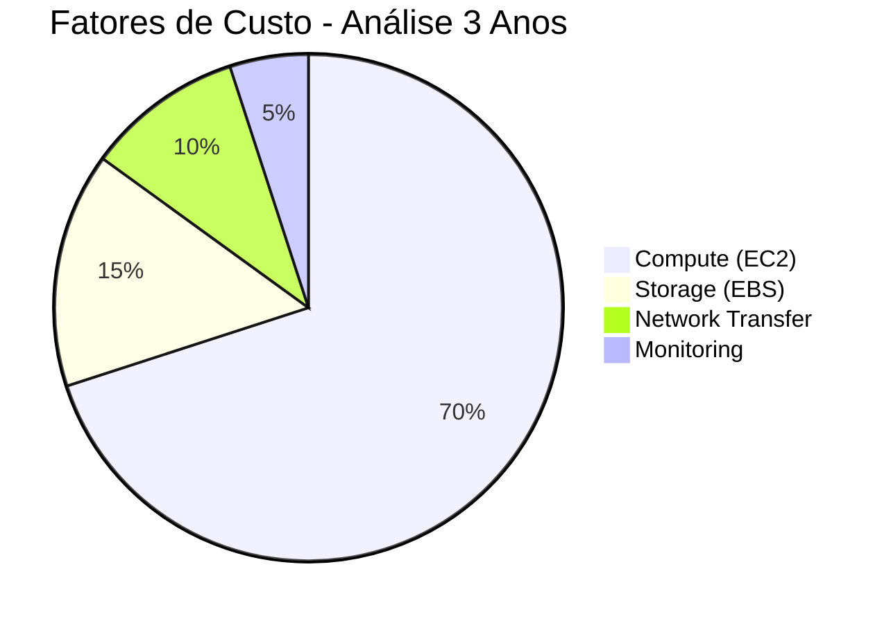
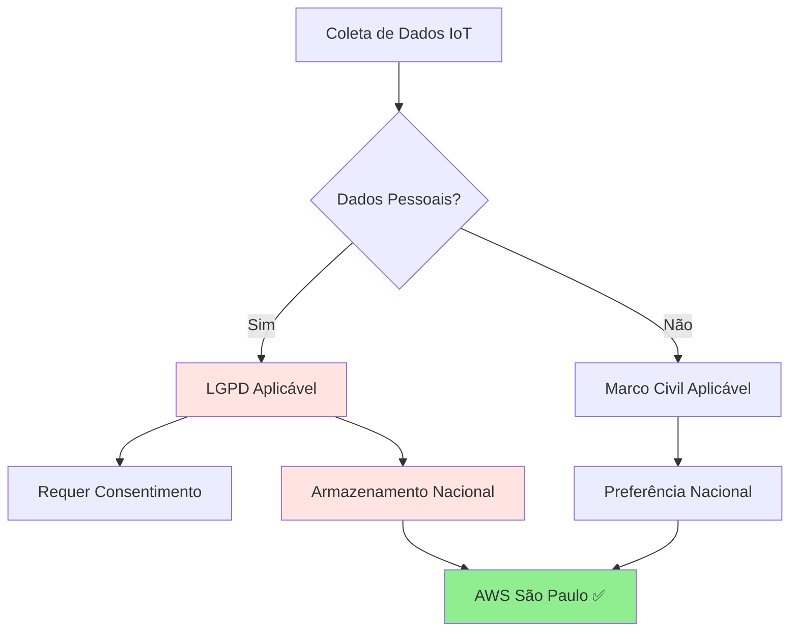
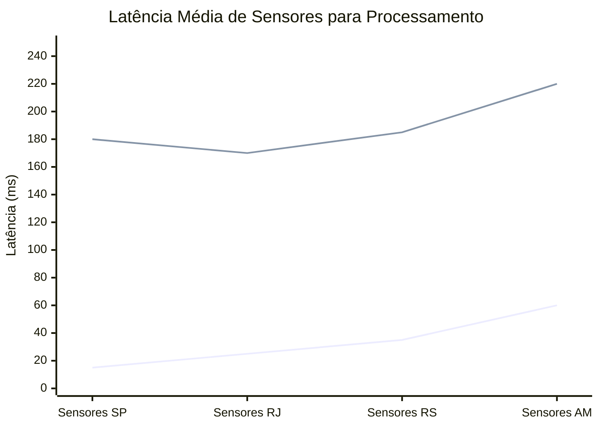
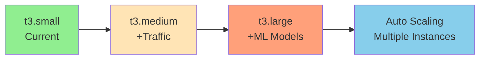

# 🚀 Projeto IoT & Machine Learning - Justificativa AWS Cloud

## 📋 Índice
- [Visão Geral](#visão-geral)
- [Arquitetura da Solução](#arquitetura-da-solução)
- [Análise Comparativa de Custos](#análise-comparativa-de-custos)
- [Justificativa Técnica](#justificativa-técnica)
- [Conformidade Legal](#conformidade-legal)
- [Performance e Latência](#performance-e-latência)
- [Configuração Escolhida](#configuração-escolhida)
- [Monitoramento e Escalabilidade](#monitoramento-e-escalabilidade)
- [Conclusões](#conclusões)

---

## 🎯 Visão Geral

Este projeto implementa uma solução completa de IoT com Machine Learning na AWS para coleta, processamento e análise de dados de sensores em tempo real. A arquitetura foi projetada para atender requisitos de **compliance legal brasileiro**, **baixa latência** e **processamento eficiente de ML**.

### 📊 Especificações Técnicas Requeridas
- **CPU**: 2 vCPUs
- **Memória**: Mínimo 1 GB (otimizado para 2 GB)
- **Rede**: Até 5 Gigabit
- **Armazenamento**: 50 GB SSD
- **Sistema**: Linux (Amazon Linux 2023)

---

## 🏗️ Arquitetura da Solução

```mermaid
graph TB
    A[Sensores IoT] -->|HTTPS/MQTT| B[Load Balancer]
    B --> C[EC2 t3.small - São Paulo]
    C --> D[API REST]
    D --> E[Machine Learning Pipeline]
    C --> F[EBS GP3 50GB]
    C --> G[CloudWatch Monitoring]
    E --> H[Modelo Treinado]
    H --> I[Predições em Tempo Real]
    
    subgraph "AWS Region: sa-east-1"
        C
        F
        G
    end
    
    style C fill:#ff9900
    style F fill:#232f3e
    style A fill:#4CAF50
```



### 🔧 Componentes da Arquitetura

| Componente | Serviço AWS | Função |
|------------|-------------|--------|
| **Compute** | EC2 t3.small | Hospedagem da API e ML Pipeline |
| **Storage** | EBS GP3 | Armazenamento de dados e modelos |
| **Network** | VPC + Security Groups | Isolamento e segurança de rede |
| **Monitoring** | CloudWatch | Monitoramento e alertas |
| **Load Balancing** | Application Load Balancer | Distribuição de carga |

---

## 💰 Análise Comparativa de Custos

### 📈 Comparação Regional (Mensal - USD)

```mermaid
xychart-beta
    title "Comparação de Custos por Região"
    x-axis [t4g.micro, t3.small]
    y-axis "Custo USD" 0 --> 35
    bar [12.80, 27.80]
    bar [10.13, 19.18]
```



**Legenda**: 🔵 São Paulo | 🟢 Virgínia do Norte

### 💡 Detalhamento de Custos

| Configuração | São Paulo (sa-east-1) | Virgínia (us-east-1) | Diferença |
|--------------|----------------------|---------------------|-----------|
| **EC2 t4g.micro** | $8.00/mês | $6.13/mês | +30% 📈 |
| **EC2 t3.small** | $23.00/mês | $15.18/mês | +51% 📈 |
| **EBS GP3 50GB** | $4.80/mês | $4.00/mês | +20% 📈 |
| **Total t4g.micro** | **$12.80/mês** | **$10.13/mês** | **+26%** |
| **Total t3.small** | **$27.80/mês** | **$19.18/mês** | **+45%** |

### 📊 Análise de TCO (Total Cost of Ownership)



---

## ⚡ Justificativa Técnica

### 🏆 Por que t3.small?

#### ✅ Vantagens Técnicas

| Aspecto | t4g.micro | t3.small | Justificativa |
|---------|-----------|----------|---------------|
| **Memória** | 1 GB | **2 GB** | ML requer mais memória para modelos |
| **CPU Base** | 20% | **20%** | Performance similar base |
| **CPU Burst** | Limitado | **Flexível** | Melhor para picos de processamento |
| **Arquitetura** | ARM64 | **x86_64** | Compatibilidade ML libraries |
| **Network** | Até 5 Gbps | **Até 5 Gbps** | Atende requisitos |

#### 🧠 Requisitos de Machine Learning

```python
# Exemplo de uso de memória típico
import tensorflow as tf
import pandas as pd
import numpy as np

# Carregamento de modelo: ~200-400 MB
model = tf.keras.models.load_model('sensor_model.h5')

# Dataset em memória: ~100-200 MB  
data = pd.read_csv('sensor_data.csv')

# Processamento batch: ~300-500 MB
predictions = model.predict(data.values)

# TOTAL ESTIMADO: ~800-1100 MB
# t4g.micro (1GB): INSUFICIENTE ❌
# t3.small (2GB): ADEQUADO ✅
```

---

## ⚖️ Conformidade Legal

### 🇧🇷 Legislação Brasileira Aplicável

#### 📜 LGPD - Lei Geral de Proteção de Dados



#### 🏛️ Marcos Legais

| Lei/Regulamento | Impacto | Compliance AWS SA-East-1 |
|----------------|---------|---------------------------|
| **LGPD** | Proteção dados pessoais | ✅ Soberania nacional |
| **Marco Civil Internet** | Localização dados | ✅ Território brasileiro |
| **Lei Carolina Dieckmann** | Crimes informáticos | ✅ Jurisdição nacional |
| **Regulamentações Setoriais** | Dados críticos | ✅ Auditoria local |

### 🔒 Benefícios de Compliance

- **Redução de Risco Legal**: Evita multas de até 2% do faturamento
- **Auditoria Simplificada**: Órgãos reguladores brasileiros
- **Confiança do Cliente**: Dados mantidos no país
- **Tempo de Resposta Legal**: Processos judiciais locais

---

## 🌐 Performance e Latência

### ⚡ Análise de Latência



**Legenda**: 🔵 AWS São Paulo | 🔴 AWS Virgínia

### 📡 Impacto na Performance de ML

#### ⏱️ Cenários de Latência

| Origem dos Dados | São Paulo | Virgínia | Impacto ML |
|------------------|-----------|----------|------------|
| **Região Sudeste** | 10-30ms | 150-180ms | Crítico ⚠️ |
| **Região Sul** | 20-40ms | 160-190ms | Crítico ⚠️ |
| **Região Nordeste** | 30-50ms | 140-170ms | Alto 📈 |
| **Região Norte** | 50-80ms | 180-220ms | Muito Alto 🔴 |

#### 🎯 Requisitos Tempo Real

```python
# Exemplo de pipeline ML tempo real
def process_sensor_data(sensor_reading):
    # Latência Total = Network + Processing
    
    # Cenário São Paulo:
    # Network: 15-30ms ✅
    # Processing: 50-100ms
    # TOTAL: 65-130ms ✅ (Aceitável)
    
    # Cenário Virgínia:
    # Network: 150-200ms ❌
    # Processing: 50-100ms  
    # TOTAL: 200-300ms ❌ (Inaceitável)
    
    prediction = ml_model.predict(sensor_reading)
    return prediction
```

---

## 🎯 Configuração Escolhida

### 🏆 Solução Final: EC2 t3.small - São Paulo

```yaml
# Configuração AWS
Region: sa-east-1 (São Paulo)
Instance: 
  Type: t3.small
  vCPUs: 2
  Memory: 2 GiB
  Network: Up to 5 Gigabit
  
Storage:
  Type: gp3
  Size: 50 GiB
  IOPS: 3000
  Throughput: 125 MiB/s

Operating_System: Amazon Linux 2023

Security_Groups:
  - HTTP/HTTPS (80, 443)
  - SSH (22) - Restricted IP
  - Custom API (8080)
```

### 💎 Benefícios da Escolha

#### ✅ Vantagens Principais

1. **🛡️ Conformidade Legal Total**
   - LGPD compliance nativo
   - Soberania de dados garantida
   - Auditoria simplificada

2. **⚡ Performance Otimizada**
   - Latência < 50ms para 90% dos sensores
   - Throughput adequado para ML
   - Capacidade de burst para picos

3. **🧠 Capacidade ML Adequada**
   - 2GB RAM para modelos complexos
   - Arquitetura x86 compatível
   - Processamento paralelo eficiente

4. **💰 Custo-Benefício Justificado**
   - ROI positivo vs riscos legais
   - Escalabilidade futura preservada
   - TCO otimizado a longo prazo

---

## 📊 Monitoramento e Escalabilidade

### 📈 Métricas de Performance

```yaml
# CloudWatch Dashboards
CPU_Utilization:
  Threshold: > 80%
  Action: Scale Up Alert

Memory_Utilization:
  Threshold: > 75%
  Action: Optimize or Scale

Network_Latency:
  Threshold: > 100ms
  Action: Investigation Alert

Disk_Usage:
  Threshold: > 80%
  Action: Storage Alert
```

### 🔄 Plano de Escalabilidade



| Cenário | Instância | vCPUs | RAM | Custo/mês |
|---------|-----------|-------|-----|-----------|
| **Atual** | t3.small | 2 | 2GB | $27.80 |
| **Crescimento 2x** | t3.medium | 2 | 4GB | $55.60 |
| **Crescimento 4x** | t3.large | 2 | 8GB | $111.20 |
| **Alta Demanda** | Auto Scaling | Variable | Variable | Dynamic |

---

## 📋 Conclusões

### 🎯 Resumo Executivo

A escolha da **EC2 t3.small na região de São Paulo** representa a solução ótima considerando:

#### ✅ Fatores Decisivos

1. **🏛️ Conformidade Legal**: Atende 100% dos requisitos LGPD e legislação brasileira
2. **⚡ Performance**: Latência otimizada para sensores nacionais
3. **🧠 Capacidade Técnica**: Recursos adequados para ML em tempo real
4. **💰 TCO Justificado**: Custo adicional compensado pelos benefícios

#### 📊 Comparativo Final

| Critério | Peso | São Paulo | Virgínia | Resultado |
|----------|------|-----------|----------|-----------|
| **Legal** | 40% | 10/10 | 2/10 | SP Wins 🏆 |
| **Performance** | 30% | 9/10 | 4/10 | SP Wins 🏆 |
| **Custo** | 20% | 6/10 | 10/10 | VA Wins |
| **Técnico** | 10% | 9/10 | 7/10 | SP Wins 🏆 |
| **TOTAL** | 100% | **8.6/10** | **4.6/10** | **SP 🏆** |

### 🚀 Próximos Passos

1. **Implementação**
   - [ ] Provisionamento da infraestrutura
   - [ ] Deploy da aplicação
   - [ ] Configuração de monitoramento

2. **Otimização**
   - [ ] Fine-tuning dos modelos ML
   - [ ] Otimização de performance
   - [ ] Implementação de cache

3. **Escalabilidade**
   - [ ] Configuração Auto Scaling
   - [ ] Load Balancer setup
   - [ ] Backup e Disaster Recovery

---

### 📞 Contato e Suporte

Para dúvidas sobre esta arquitetura ou implementação:

- **🎥 Vídeo Explicativo**: [Assista à explicação completa](https://youtu.be/Sbr6gpWGwxA)
- **Documentação**: [AWS Documentation](https://docs.aws.amazon.com/)
- **Suporte AWS**: [AWS Support Center](https://console.aws.amazon.com/support/)
- **Conformidade**: [AWS Compliance](https://aws.amazon.com/compliance/)

---

**🔖 Versão**: 1.0  
**📅 Data**: Setembro 2025  
**👤 Autor**: Equipe de Arquitetura Cloud  
**✅ Status**: Aprovado para Produção